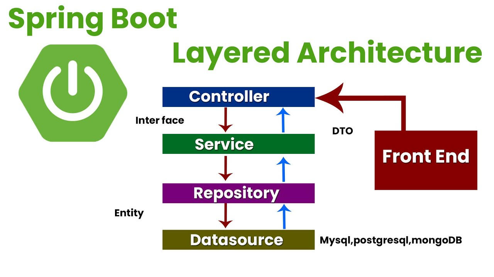
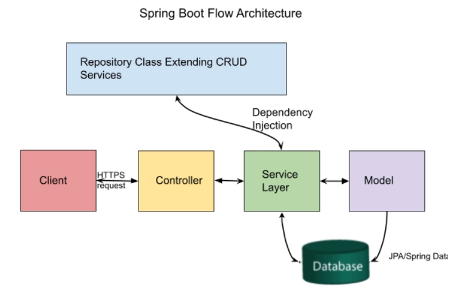
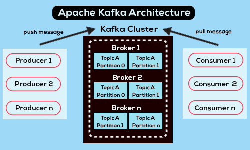
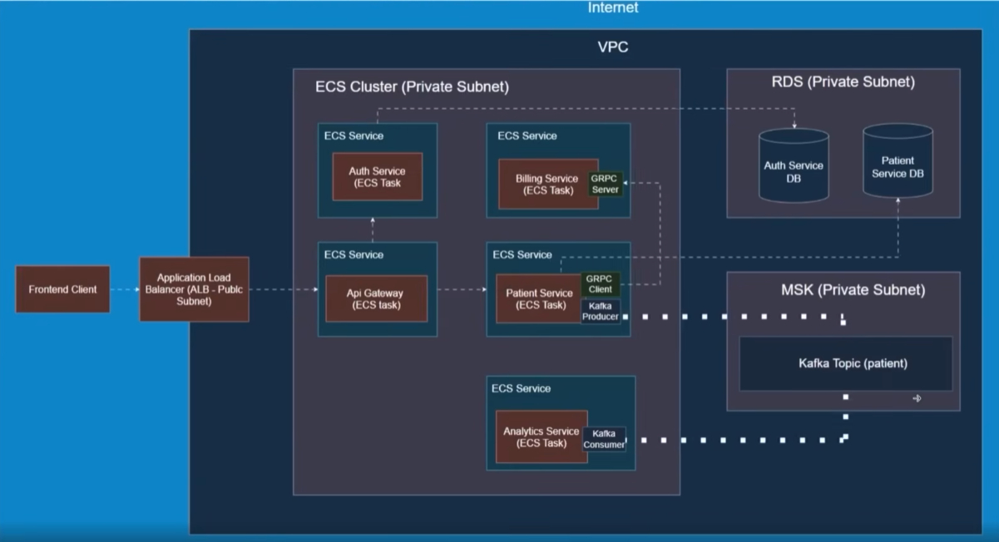

# Patient Management System

## Basic Architecture of Spring Boot Application

### All Layers in an Application



### Flow of the Architecture



## Why use DTOs?

- Keep the internal domains models (your database entities) hidden from the client. This protects your app's internal structure.
- Allow you to send or receive only the fields relevant to the client, rather than exposing all fields in your domain model.
- Request DTOs allow you to validate client input (e.g., checking if fields are null or meet certain criteria).

---

## Swagger Integration

`springdoc-openapi` java library helps to automate the generation of API documentation using spring boot projects. It automatically generates documentation in **JSON/YAML and HTML format** APIs.

1. Integrate swagger-ui, by adding the dependency in `pom.xml`

    ```xml
    <dependency>
      <groupId>org.springdoc</groupId>
      <artifactId>springdoc-openapi-starter-webmvc-ui</artifactId>
      <version>2.8.6</version>
   </dependency>
    ```

2. This will automatically deploy swagger-ui to a spring-boot application:

    - The Swagger UI page will then be available at <http://server:port/context-path/swagger-ui.html>
    - The OpenAPI description will be available at the following url for json format: <http://server:port/context-path/v3/api-docs>

---

## Used Dependencies in this Project

### Dependency Versions as `<properties>` in `pom.xml`

```xml
  <properties>
    <java.version>21</java.version>
    <grpc.version>1.71.0</grpc.version>
    <protobuf-java.version>3.25.6</protobuf-java.version>
    <spring-grpc.version>0.5.0</spring-grpc.version>
    <spring-kafka.version>3.3.4</spring-kafka.version>
  </properties>
```

### List of Dependency, used as Requirement

```xml
<!--GRPC -->
<dependency>
    <groupId>io.grpc</groupId>
    <artifactId>grpc-netty-shaded</artifactId>
    <version>${grpc.version}</version>
</dependency>
<dependency>
    <groupId>io.grpc</groupId>
    <artifactId>grpc-protobuf</artifactId>
    <version>${grpc.version}</version>
</dependency>
<dependency>
    <groupId>io.grpc</groupId>
    <artifactId>grpc-stub</artifactId>
    <version>${grpc.version}</version>
</dependency>

<dependency> <!-- necessary for Java 9+ -->
    <groupId>org.apache.tomcat</groupId>
    <artifactId>annotations-api</artifactId>
    <version>6.0.53</version>
    <scope>provided</scope>
</dependency>
<dependency>
    <groupId>net.devh</groupId>
    <artifactId>grpc-spring-boot-starter</artifactId>
    <version>3.1.0.RELEASE</version>
</dependency>

<dependency>
    <groupId>com.google.protobuf</groupId>
    <artifactId>protobuf-java</artifactId>
    <version>${protobuf-java.version}</version>
</dependency>

<dependency>
    <groupId>org.springframework.kafka</groupId>
    <artifactId>spring-kafka</artifactId>
    <version>${spring-kafka.version}</version>
</dependency>
```

### `<build>` Section of `pom.xml` file

```xml
  <build>
    <extensions>
        <!-- Ensure OS compatibility for protoc -->
        <extension>
            <groupId>kr.motd.maven</groupId>
            <artifactId>os-maven-plugin</artifactId>
            <version>1.7.0</version>
        </extension>
    </extensions>
    <plugins>
        <!-- Spring boot / maven  -->
        <plugin>
            <groupId>org.springframework.boot</groupId>
            <artifactId>spring-boot-maven-plugin</artifactId>
        </plugin>

        <!-- PROTO -->
        <plugin>
            <groupId>org.xolstice.maven.plugins</groupId>
            <artifactId>protobuf-maven-plugin</artifactId>
            <version>0.6.1</version>
            <configuration>
                <protocArtifact>com.google.protobuf:protoc:${protobuf-java.version}:exe:${os.detected.classifier}</protocArtifact>
                <pluginId>grpc-java</pluginId>
                <pluginArtifact>io.grpc:protoc-gen-grpc-java:${grpc.version}:exe:${os.detected.classifier}</pluginArtifact>
            </configuration>
            <executions>
                <execution>
                    <goals>
                        <goal>compile</goal>
                        <goal>compile-custom</goal>
                    </goals>
                </execution>
            </executions>
        </plugin>
    </plugins>
  </build>
```

---

## Run docker compose to Start each service

1. Patient Service

    ```bash
    cd patient-service
    docker compose -f .\docker-compose.patient-service.yml up -d
    # This includes the patient-service-db (PostgreSQL)
    ```

2. Billing Service

    ```bash
    cd billing-service
    docker compose -f .\docker-compose.billing-service.yml up -d
    ```

3. Kafka

    ```bash
    # from Root of the project
    docker compose up -d
    ```

---

## gRPC (Google Remote Procedure Calls)

gRPC is a high-performance, open-source RPC (Remote Procedure Call) framework that enables seamless communication between microservices. It uses Protocol Buffers (Protobuf) as the interface definition language (IDL) and supports bi-directional streaming and efficient binary serialization.

### Why Use gRPC?

- **Efficient & Fast** - Uses HTTP/2 and Protobuf for compact and fast communication.
- **Strongly Typed APIs** - Enforces contract-based communication using .proto files.
- **Streaming Support** - Supports Unary, Server Streaming, Client Streaming, and Bi-directional Streaming.
- **Multi-language Support** - Works across multiple programming languages.
- gRPC supports both synchronous and asynchronous Remote Procedure Calls (RPCs)

### Architecture in Microservices

- gRPC Server (Billing Service) → Provides gRPC services.
- gRPC Clients (Other Services) → Consume the services via generated stubs.
- Proto File (.proto) → Defines the service contract.

### gRPC Implementation in `billing_service.proto`

```proto
syntax = "proto3";

package billing;
option java_multiple_files = true;
option java_package = "com.supersection.grpc";
option java_outer_classname = "BillingProto";


service BillingService {
  rpc CreateBillingAccount (BillingRequest) returns (BillingResponse);
}

message BillingRequest {
  string patientId = 1;
  string name = 2;
  string email = 3;
}

message BillingResponse {
  string accountId = 1;
  string status = 2;
}
```

#### Generate Java Classes from Proto

```bash
mvn clean compile
```

### gRPC Communication Flow

1. Client Microservice calls gRPC stub.
2. Stub converts request into a Protobuf message and sends it via HTTP/2.
3. Server Microservice (Billing Service) processes the request and sends a response.
4. Client receives response and processes it.

---

## Kafka

### gRPC vs Kafka

- **gRPC**: 1-to-1 microservice communication, when you need an immediate response (synchronous).
- **Kafka**: 1-to-many microservice communicate, do not need an immediate response (i.e., asynchronous)

### Architecture of Kafka



### IDE Setup

- **VS Code**: Install "vscode-kafka" extension and Add a new Cluster
- **IntelliJ IDEA**: Install "Kafka" plugin and Add a new Connection

> For VSCode, use `.kafka` files for handling consumer & producer

---

## Resolve Package related Issues

1. Go into the specific service folder, for Example:

    ```bash
    cd analytics-service
    ```

2. Remove already existing target folder

    ```bash
    rm -rf target
    ```

3. Compile the code freshly using Maven

    ```bash
    # mvn clean generated-sources compile
    mvn clean compile
    ```

4. Check if the files are correctly regenerated.

---

## API Gateways

- An API Gateway acts as a single entry point for clients to interact with multiple microservices.

- **Responsibilitis**:

  - Request routing to appropriate microservices.
  - Aggregating responses from multiple services.
  - Authentication and authorization.
  - Rate limiting and throttling.
  - Logging and monitoring.
  - Handling cross-cutting concerns (e.g., CORS, caching).

- **Why Use It**:
  - Hides service internals from the client.
  - Simplifies client-side logic.
  - Enhances security and control.

- **Common Tools**: Kong, NGINX, AWS API Gateway, Istio (in service mesh), Spring Cloud Gateway, Zuul.

---

## Auth Service Dependencies

Check out these dependencies and their latest versions on [Official Maven Repository](https://mvnrepository.com/)

```xml
<dependency>
    <groupId>org.springframework.boot</groupId>
    <artifactId>spring-boot-starter-data-jpa</artifactId>
</dependency>
<dependency>
    <groupId>org.springframework.boot</groupId>
    <artifactId>spring-boot-starter-security</artifactId>
</dependency>
<dependency>
    <groupId>org.springframework.boot</groupId>
    <artifactId>spring-boot-starter-web</artifactId>
</dependency>

<dependency>
    <groupId>io.jsonwebtoken</groupId>
    <artifactId>jjwt-api</artifactId>
    <version>0.12.6</version>
</dependency>
<dependency>
    <groupId>io.jsonwebtoken</groupId>
    <artifactId>jjwt-impl</artifactId>
    <version>0.12.6</version>
    <scope>runtime</scope>
</dependency>
<dependency>
    <groupId>io.jsonwebtoken</groupId>
    <artifactId>jjwt-jackson</artifactId>
    <version>0.12.6</version>
    <scope>runtime</scope>
</dependency>

<dependency>
    <groupId>org.postgresql</groupId>
    <artifactId>postgresql</artifactId>
    <scope>runtime</scope>
</dependency>
<dependency>
    <groupId>com.h2database</groupId>
    <artifactId>h2</artifactId>
</dependency>

<dependency>
    <groupId>org.springdoc</groupId>
    <artifactId>springdoc-openapi-starter-webmvc-ui</artifactId>
    <version>2.6.0</version>
</dependency>

<dependency>
    <groupId>org.springframework.boot</groupId>
    <artifactId>spring-boot-starter-test</artifactId>
    <scope>test</scope>
</dependency>
<dependency>
    <groupId>org.springframework.security</groupId>
    <artifactId>spring-security-test</artifactId>
    <scope>test</scope>
</dependency>
```

---

## Introduction to Testing

- **Unit Testing**: Tests individual units (classes, methods) in isolation.

- **Integration Testing**: Tests multiple components working together, such as a controller, service, repository. Can also mean testing multiple parts of a wider system.

- **E2E Testing**: Tests the complete workflow of the application, from UI to API.

- Security Testing, Performance Testing, Constract Testing, Acceptance Testing etc.

### Integration Test for this project

Using [REST-assured](https://rest-assured.io/) for testing of REST services.

#### Dependencies for Integration Tests module

```xml
<dependencies>
    <dependency>
        <groupId>io.rest-assured</groupId>
        <artifactId>rest-assured</artifactId>
        <version>5.3.0</version>
        <scope>test</scope>
    </dependency>
    <dependency>
        <groupId>org.junit.jupiter</groupId>
        <artifactId>junit-jupiter</artifactId>
        <version>5.11.4</version>
        <scope>test</scope>
    </dependency>
</dependencies>
```

---

## Code Deployment

- [AWS (Amazon Web Services)](https://aws.amazon.com/) - Not Free!
- [Localstack](https://www.localstack.cloud/) - AWS simulator we can run locally
- The deployment code and approach are compatible with actual AWS services.

### Services to be used

- VPC (Virtual Private Network)
- ECS (Elastic Container Service)
- ALB (Application Load Balancer)

Install [AWS CLI](https://docs.aws.amazon.com/cli/latest/userguide/getting-started-install.html) locally.

- Check aws-cli installation: `aws --version`
- Configure aws-cli: `aws configure`
- Check configuration:

    ```bash
    # For localstack setup
    aws --endpoint-url=http://localhost:4566 lambda list-functions

    # For official AWS account
    aws --endpoint-url=http://localhost:4566 lambda list-functions
    ```

### IaC (Infrastructure as Code)

- Write our infrastructure in Java Code, which can be put into source control, like we do with our application code
- Environments can be created, destroyed easily and consistently
- Easier to debug and follow along

### Dependencies used for AWS Infrastructure as Java Code

```xml
<dependencies>
    <dependency>
      <groupId>software.amazon.awscdk</groupId>
      <artifactId>aws-cdk-lib</artifactId>
      <version>2.178.1</version>
    </dependency>
    <dependency>
      <groupId>com.amazonaws</groupId>
      <artifactId>aws-java-sdk</artifactId>
      <version>1.12.780</version>
    </dependency>
</dependencies>
```

### AWS Deployment Services



---

### AWS Document Guides

- [Create ECR Private repo](https://docs.aws.amazon.com/AmazonECR/latest/userguide/repository-create.html) for storing docker images

---

### Author

Developed by [Soumo Sarkar](https://www.linkedin.com/in/soumo-sarkar/) @2025
